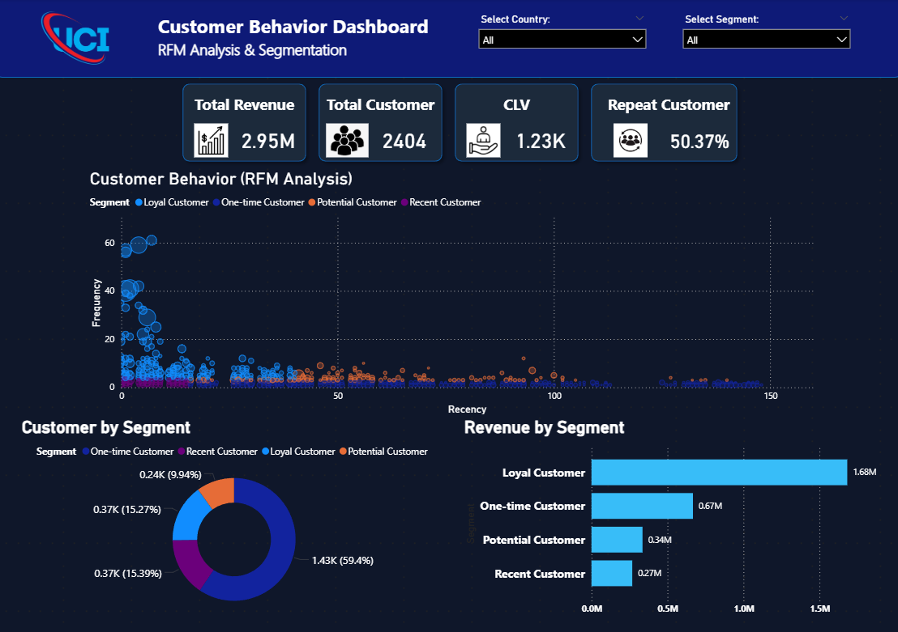
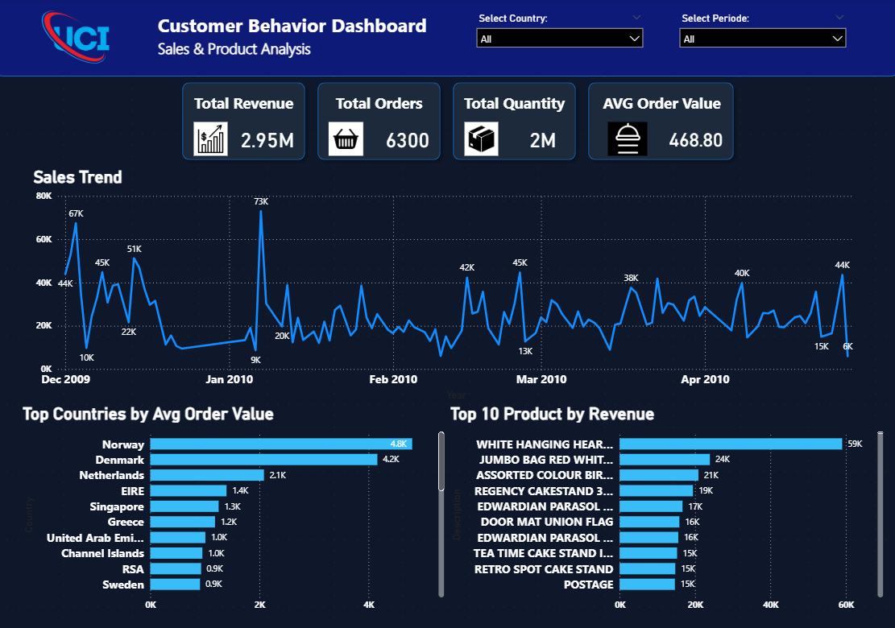
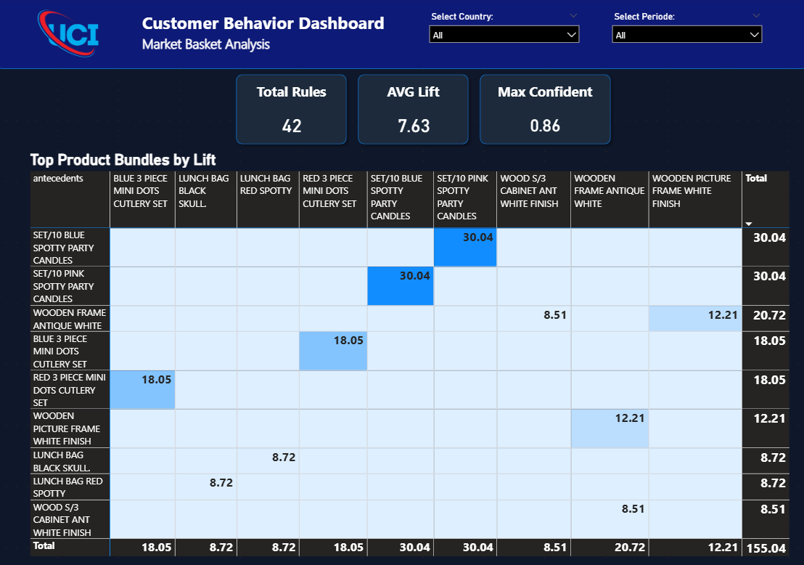

# Customer-Behavior-Product-Association-Analysis

This project analyzes customer purchasing behavior and product relationships using **RFM Segmentation** and **Market Basket Analysis (MBA)**.

The goal is to identify key drivers of revenue and uncover actionable insights to improve customer retention and increase sales.

---

## 🎯 Objectives

- Identify high-value customers using RFM segmentation  
- Understand customer purchasing behavior  
- Analyze product relationships and buying patterns  
- Discover opportunities to increase revenue and retention  

---

## 🧰 Tools & Technologies

- Google Collab(Python)
- Power BI
- Canva

---

## 📸 Dashboard Preview

### 🔹 Customer Behavior (RFM Analysis)

### 🔹 Sales & Product Analysis

### 🔹 Market Basket Analysis

---

## 📊 Key Analysis

### 1. RFM Segmentation
- Loyal customers generate the majority of revenue  
- One-time customers dominate in volume but not in value  

---

### 2. Sales & Product Analysis
- Revenue is concentrated in a small number of top-performing products  
- Sales fluctuate across periods with noticeable peaks  

---

### 3. Market Basket Analysis (MBA)
- Strong product associations identified using lift, confidence, and support  
- Example: Customers who purchase **Blue Spotty Candles** are likely to also purchase **Pink Spotty Candles**

---

## 💡 Key Insights

- High-value (loyal) customers drive most of the revenue  
- A small set of products contributes disproportionately to sales  
- Product bundling presents a strong opportunity to increase basket size  

---

## 🚀 Business Recommendations

- Retain loyal customers through targeted engagement  
- Convert one-time customers into repeat buyers  
- Bundle frequently purchased products  
- Optimize sales strategies during peak periods  

---

## 🔗 Additional Resources

- 📊 [Power BI Dashboard](customer_behavior_dashboard.pbix)  
- 📈 [Presentation Slides](customer_behavior_analysis.pdf)  
- 📓 [Google Collab Notebook](https://colab.research.google.com/drive/1AnYbpq6VtQRJ1IvaODfY7nA_JyQIDhOH?usp=sharing)

---

## 👤 Author

**Muhammad Rafly Alviansyah**  
📧 muhraflyalviansyah@gmail.com  
🔗 https://www.linkedin.com/in/raflyalvish/

---

## 📌 Notes

This project focuses on translating data into actionable business insights.  
Further validation is recommended to measure the exact impact of proposed strategies.
